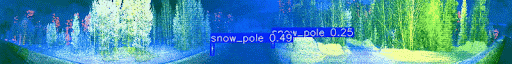

# Snow Pole Detection for Autonomous Driving in Winter Conditions

> **TDT4265 – Computer Vision and Deep Learning** | Mini-Project  
> Stefano Lattenero & Tanguy Guyot · NTNU

## Sample LIDAR realtime-detection




---

## Motivation

In heavy snow, road markings and edges are often completely obscured. Snow poles remain visible above the snow surface and act as reliable indicators of road boundaries — a standard fixture along Norwegian roads during harsh winters. Their high-contrast colors are specifically chosen to stand out against the white snow background.

This project tackles the challenge of **real-time snow pole detection** to delineate road boundaries under heavy snow and enable safer autonomous driving in winter conditions.

---

## Project Overview

We fine-tune lightweight YOLO models on two complementary datasets collected by the [NAPLab](https://www.ntnu.edu/nap) at NTNU:

| Dataset | Resolution | Characteristics |
|---------|-----------|-----------------|
| **LiDAR** | 1024 × 128 px | Near-IR / Signal / Reflectivity channels mapped to RGB; high contrast, easier pole identification |
| **RGB** | 1920 × 1208 px | Natural camera images; realistic but blurry due to snow, dark conditions |

Labels for both datasets use the standard YOLO bounding box format:
```
<class_id> <x_center> <y_center> <width> <height>
```

---

## Approach

1. **Data preparation** — Pool and re-split training/validation data with a controlled random seed for reproducibility
2. **Model comparison** — Benchmark multiple lightweight YOLO variants (v5n/s/m, v8n/s) on both datasets across precision, recall, mAP@0.5, mAP@0.5:0.95, and FPS
3. **Model selection** — Pick the best speed/accuracy trade-off per dataset
4. **Fine-tuning** — Train chosen models for 50 epochs at 640 × 640 input resolution on the IDUN HPC cluster (Tesla P100-PCIE-16GB)
5. **Inference** — Evaluate on held-out test sets

---

## Results

### Selected Models

| Dataset | Model | Precision | Recall | mAP@0.5 | mAP@0.5:0.95 | FPS |
|---------|-------|-----------|--------|---------|--------------|-----|
| LiDAR | **YOLOv5m** | 0.839 | 0.669 | 0.754 | 0.332 | 27.4 |
| RGB | **YOLOv8n** | 0.876 | 0.765 | 0.861 | 0.491 | 10.85 |

### Key Takeaways

- **LiDAR + YOLOv5m** — Excellent real-time throughput (27 FPS), well-suited for high-speed scenarios such as highway driving. Moderate recall means approximately 1 in 3 distant poles may be missed.
- **RGB + YOLOv8n** — Higher precision and recall with tighter bounding boxes, better suited for complex low-speed environments (urban streets, intersections) despite lower FPS.

---

## Sustainability

One training run was performed on an Apple M2 chip (25 W average) and completed in ~29.5 minutes:

```
E = 0.025 kW × 0.491 h ≈ 0.012 kWh
```

This is equivalent to driving a Tesla Model Y **approximately 77 meters**.

### Energy Efficiency

The M2 training run demonstrates **minimal energy consumption** relative to the computational work performed. At ~0.012 kWh per 50-epoch training cycle, this approach is highly sustainable for prototyping and model selection. However, scaling to multiple training runs (as done on the HPC cluster) would increase consumption proportionally. The low power draw of edge devices (M2, mobile GPUs) makes this workflow suitable for iterative development with environmental consideration.


## Quick Start

> Dataset redistribution is prohibited per course guidelines (TDT4265, NTNU).
Dataset was provided by NTNU Deep Learning & Computer Vision course ; therefore, it is not available here. If you have a similar dataset
made of onboard vehicle snow pole images for real-time autonomous driving, in LIDAR and RGB, you can add them in data/yolo_dataset and try for a training and inference run.

### 1. Install dependencies
```bash
pip install -r requirements.txt
```

### 2. Prepare dataset
Edit `data/prepare_dataset.py` to set your source data paths, then run:
```bash
python data/prepare_dataset.py
```

### 3. Train model
```bash
python scripts/train.py --type rgb --model yolov8n
# or for LIDAR:
python scripts/train.py --type lidar --model yolov5m
```

### 4. Run inference
Place test images in `data/test_images/`, then:
```bash
python scripts/inference.py --type rgb --model yolov8n
```

## Project Structure

```
.
├── data/               # Dataset preparation & test images
│   ├── prepare_dataset.py
|   ├── yolo_images     # Put train images here
│   └── test_images/    # Put test images here
├── scripts/            # Training & inference scripts
│   ├── train.py
│   └── inference.py
├── models/             # Trained model weights
│   ├── rgb/
│   └── lidar/
└── requirements.txt
```

## Models Available

- **RGB**: YOLOv8n, YOLOv8s, YOLOv5n, YOLOv5s
- **LIDAR**: YOLOv5m, YOLOv5s, YOLOv8m, YOLOv8n, YOLOv8s

## Requirements

- Python 3.8+
- ultralytics
- torch
- tqdm
- pyyaml
